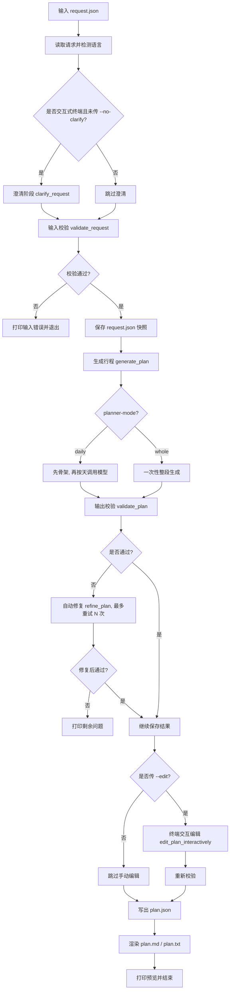

# OpenTravel 项目运行流程

这份文档用来说明 OpenTravel LocalAgentCLI 现在的完整执行链路。  
它关注的是“从输入开始，到最终输出”的真实流程，而不是单纯的目录结构。

## 流程图

## 从输入到输出

### 1. 输入阶段

用户先提供一个请求 JSON，最少需要这些字段：

- `origin_city`
- `destination`
- `start_date`
- `end_date`
- `arrival_mode`
- `travelers`
- `transport_mode`
- `must_do`

可选字段包括：

- `budget_level`
- `notes`
- `special_requirements`
- `language`

入口在 `main.py`。程序会先读取文件，再根据内容检测语言，作为后面澄清和输出格式的依据。

### 2. 澄清阶段

如果程序运行在交互式终端里，并且没有加 `--no-clarify`，就会进入澄清流程。

澄清阶段主要做四件事：

- 补齐缺失的必填字段
- 询问预算、节奏、住宿偏好
- 如果是自驾，询问每日驾驶上限
- 询问本地活动偏好，并把选中的活动合并到 `must_do`

这一层的目标不是“多问”，而是把会影响行程生成的关键条件问清楚。

### 3. 输入校验

澄清完成后，程序会先校验请求是否合法。

这里检查的是：

- 字段是否齐全
- 日期格式是否正确
- 人数是否合理
- 到达方式和交通方式是否合法
- `must_do` 是否为空

如果输入本身不合法，程序会直接停止，不会进入生成阶段。

### 4. 保存输入快照

校验通过后，程序会把当前请求保存成 `request.json`。

如果你指定了 `--artifact-dir`，所有本次运行产物都会写到那个目录里。  
如果没指定，默认写到 `outputs/latest/`。

### 5. 行程生成

接下来进入 `generate_plan()`。

这里有两条主路：

- `daily`
- `whole`

#### `daily` 模式

这是当前更稳定的模式，也是现在项目里最重要的生成方式。

它不是一次性把整段 3 天游程全交给模型，而是先搭一个本地骨架，再按天逐个生成。  
这样做的核心目的，是把“大问题”拆成“小问题”，让模型每次只负责当天的细化。

#### daily 的实际步骤

1. 先调用本地骨架生成器 `_generate_mock_plan()`。
2. 骨架会先把整趟行程的 `trip_summary` 和 `days` 结构搭好。
3. 对于每一天，程序会单独构造一个当天 prompt。
4. prompt 里不会只放当天信息，还会放前文摘要和历史上下文。
5. 模型只需要补当天的 5 到 7 个 slot。
6. 模型返回后，程序会把日期、夜宿城市、slot 编号重新归一化。
7. 每一天都生成完以后，程序会把这一天的文本摘要加入历史上下文，供后一天继续参考。
8. 3 天游程全部完成后，再把每天的结果拼成最终 plan。

#### daily 每次喂给模型的内容

当天 prompt 的核心不是“整段行程”，而是一个简化后的单日任务包，里面通常有这些内容：

- `trip`
  - 出发地
  - 目的地
  - 日期范围
  - 人数
  - 到达方式
  - 交通方式
  - 预算档位
- `day_request`
  - 第几天
  - 当天日期
  - 当天夜宿城市
  - 当天主题提示
  - 当天需要优先覆盖的 `must_do`
  - 前一天的简要衔接信息
  - 用户备注
- `planning_history`
  - 已经生成了几天
  - 最近一天的摘要
  - 已经出现过的重点景点或活动
  - 最近几条已覆盖文本样本
- `requirements`
  - 只生成 5 到 7 个 slot
  - 使用明确的 title 和 location
  - 当天最后一个 slot 必须是 hotel
  - 到达日要有 arrival transfer
  - 若是离开日，要有 departure transfer
  - 尽量避免重复已经出现过的重点

#### daily 为什么更稳

这个模式更适合小模型，也更容易控制每天的节奏和跨天衔接，原因主要有三点：

- 每次只生成一天，输出长度更可控
- 前一天结果会进入后一天上下文，重复更少
- 骨架先定下来以后，模型不容易把整段路线写散

#### daily 的结果如何合并

每一天模型输出后，程序都会做一次归一化处理：

- 保留当天的日期
- 保留当天的夜宿城市
- 把 slot_id 重新编号成连续序列
- 如果模型返回空结果，就退回当天骨架

然后程序再把这一天追加进最终的 `days` 数组，直到所有天都完成。

#### `whole` 模式

这是一次性生成整段行程的模式。

优点是整体感更强，缺点是对模型稳定性和 JSON 格式要求更高。

### 6. 模型调用

实际调用模型的入口是 `generate_with_model()`。

当前实现优先走 Ollama 原生 `/api/chat`，如果模型名不是 `ollama/` 开头，再尝试 LiteLLM 路线。

这意味着：

- 本地 Ollama 是当前主路径
- `think: false` 被显式关闭，尽量减少长思考占用
- 模型只负责生成结构化 JSON，不负责最终展示

### 7. 输出校验

生成完之后，程序会对行程做一次后校验。

校验重点包括：

- 每天是否有 slot
- 每天最后一个 slot 是否是 hotel
- 每个 slot 的时间是否合法
- 是否存在重叠
- `must_do` 是否被覆盖

如果校验不通过，程序会进入自动修复。

### 8. 自动修复

如果启用了 LLM，并且校验失败，程序会调用 `refine_plan()`。

这一步是“自动修复”，不是人工编辑。

当前实现会把：

- 请求原文
- 校验错误列表
- 当前 plan

一起喂给模型，让它尝试修补最少必要的内容。

默认最多重试若干次，次数由 `--refine-retries` 控制。

如果重试后仍未通过，程序会把剩余问题打印出来，但仍然会继续保存结果，方便你查看和调试。

### 9. 手动编辑

如果你加了 `--edit`，程序会在生成之后进入终端编辑模式。

可用命令包括：

- `help`
- `show`
- `show day <n>`
- `delete <day> <slot_id>`
- `set <day> <slot_id> <field> <value>`
- `done`

这个阶段的定位是“人来最后把关”，适合对 slot 做微调。

### 10. 输出阶段

最后会写出两个层面的结果：

- `plan.json`：结构化结果，给程序后续继续处理
- `plan.md` 或 `plan.txt`：给人直接阅读的攻略

渲染逻辑由 `renderer.py` 负责。

## 当前项目功能总结

现在这套系统已经能完成以下事情：

- 读入旅行需求
- 交互式澄清
- 按天或整段生成行程
- 自动校验
- 自动修复
- 手动编辑
- 导出 JSON 和 Markdown / Text

它暂时还不包含：

- 实时航班查询
- 实时酒店和地图 API
- 前端页面
- 真正的知识库 / RAG

所以你可以把它理解成一个已经跑通的“本地旅行规划 CLI 原型”，而不是完整在线产品。

## 2026-04-21 流程更新：自动修复机制已经变化

上面的主流程描述仍然成立，但“自动修复”这一段，当前已经和最初版本不一样了。

### 1. 不再优先做整份 refine

早期的实现思路更像是：

- 把整份 `plan`
- 连同整份错误列表
- 一次性交给模型重写或修补

这种方式在本地小模型上效果并不好，模型很容易：

- 原样返回
- 只改文案，不改结构
- 或者把没问题的部分也改坏

### 2. 当前改成了局部重绘

现在的修复流程更接近：

1. `validation` 先定位问题属于哪一天
2. 再识别问题类型和重点 `slot`
3. `refiner` 只把有问题的那一天，或那一天里的单个问题，发给模型
4. 模型返回新的 `day`
5. 系统把这个 `day` 替换回原计划
6. 再跑一次 `validation`

这意味着当前的修复已经不是“整份重写”，而是“局部状态替换”。

### 3. 当前修复粒度

当前修复粒度已经从“大块整份修复”收缩成两层：

- `day` 级别：哪一天有问题，就优先修哪一天
- `issue / slot` 级别：如果一天里有多个问题，再按单条问题逐个修

所以你可以把当前修复机制理解成：

`whole` 负责首版生成  
`validation + refiner` 负责更像 `daily + slot` 的局部更新

### 4. 这不代表 daily 被放弃

`daily` 模式后面仍然要继续做，而且后续会继续优化跨天记忆和分段质量。

但当前阶段，我们已经把“按天 / 按段修”的思想先用在了修复链路里，而不是继续让 `daily` 承担当前主生成质量。
